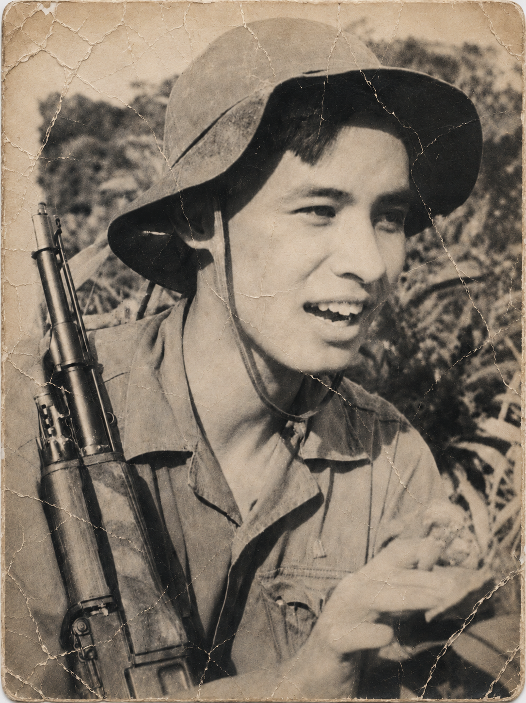
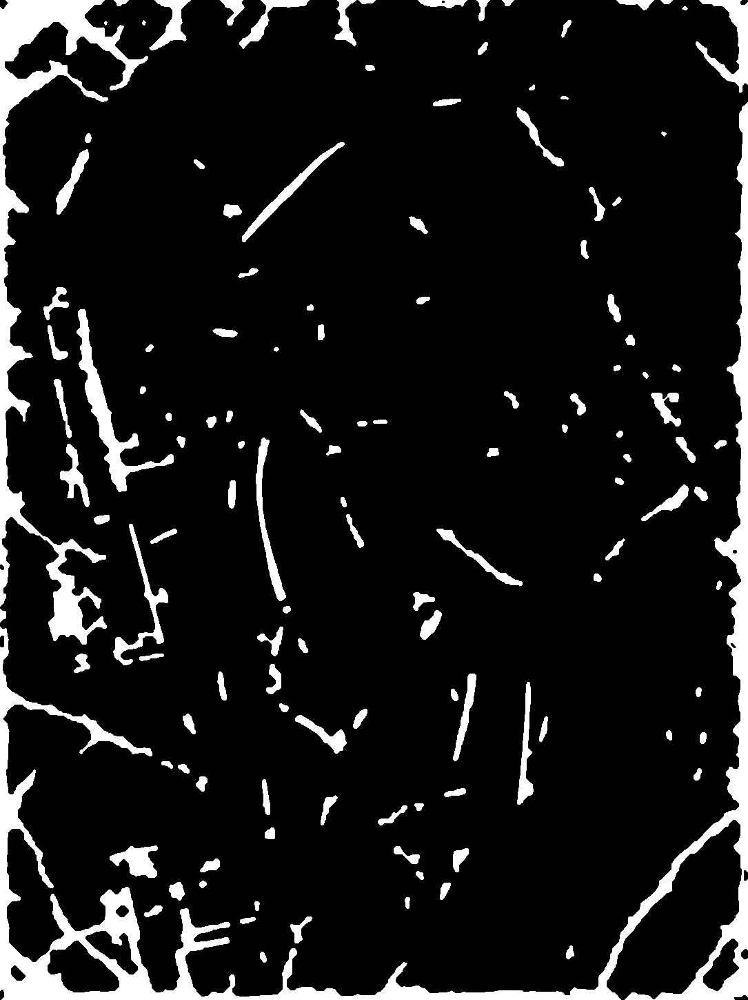
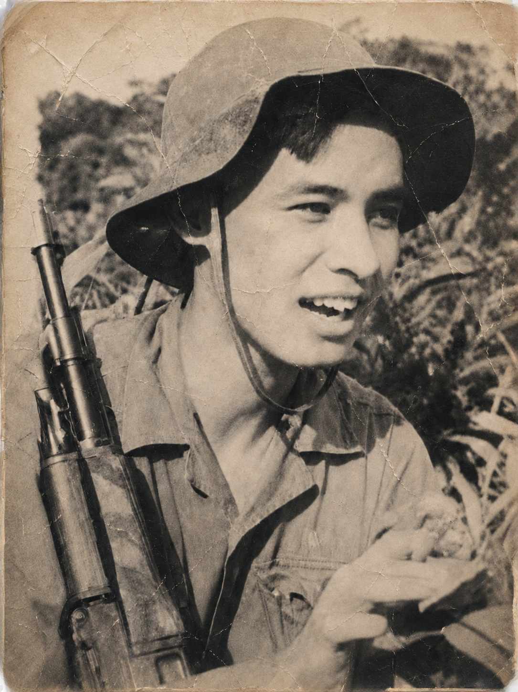
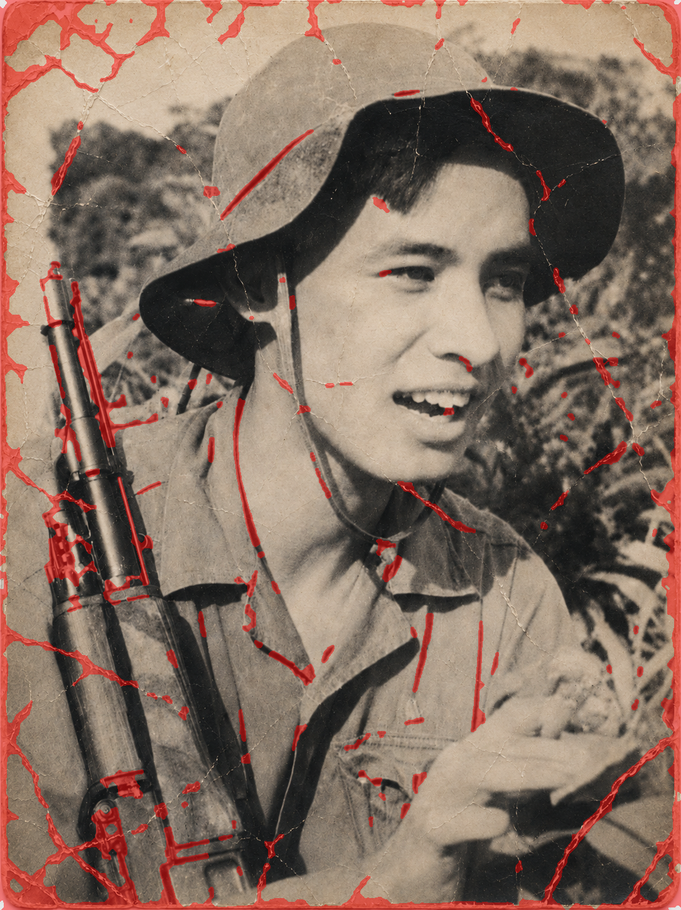

<div align="center">

# Phục Hồi Ảnh Cũ với Deep Learning

### Old Photo Restoration - Modular Deep Learning Pipeline

**Crack Segmentation · Attention Gate U-Net · Hybrid Mask Construction · Pretrained LaMa Inpainting**

<br>

[](https://www.python.org/)
[](https://pytorch.org/)
[](https://developer.nvidia.com/cuda-toolkit)
[](http://127.0.0.1:7860)
[](#docker--deployment)

<br>


`<sub><b>`Input photo `</b>` &nbsp;→&nbsp; `<b>`Predicted repair mask `</b>` &nbsp;→&nbsp; `<b>`LaMa restored output `</b></sub>`

</div>

---

## Giới thiệu

Ảnh cũ thường xuống cấp theo hai nhóm hư hại khác nhau:

- **Structured damage** - vết nứt giấy, vết xước, rách nhỏ: có cấu trúc không gian rõ, cần xác định vùng hư hại trước khi inpaint.
- **Unstructured degradation** - nhiễu hạt, mờ, phai màu: ảnh hưởng toàn cục, khó tách thành vùng biên rõ ràng.

Một mạng end-to-end duy nhất thường có xu hướng học nghiệm trung bình: ảnh có thể mượt hơn nhưng vết nứt vẫn còn, hoặc texture bị làm nhòe. Dự án này chọn hướng **modular restoration pipeline**: tách bài toán thành segmentation, hybrid mask construction, inpainting, và optional face restoration. Mỗi module có artifact trung gian riêng, giúp quan sát lỗi, debug và đánh giá rõ hơn.

---

Pipeline tổng quan

```text
      Input old photo (RGB)
               │
               ▼
┌─────────────────────────────┐
│  R013 U-Net + Attention Gate│  ← Deep Learning segmentation
│  CrackSegmenter             │    phát hiện vùng cần sửa
└──────────────┬──────────────┘
               │  dl_mask.png
               ▼
┌─────────────────────────────┐
│  Classical CV Crack Detector│  ← CLAHE + morphology + component filter
│  bắt crack mảnh tương phản  │    bổ sung cho DL mask
└──────────────┬──────────────┘
               │  cv_mask.png
               ▼
┌─────────────────────────────┐
│  Hybrid Union Mask          │  union_mask = max(dl_mask, cv_mask)
└──────────────┬──────────────┘
               │  union_before_refine.png
               ▼
┌─────────────────────────────┐
│  repair_wide_v1 Refinement  │  gap bridging + dilation
│  làm mask phù hợp cho LaMa  │
└──────────────┬──────────────┘
               │  final_mask.png
               ▼
┌─────────────────────────────┐
│  Pretrained LaMa Wrapper    │  external inpainting runtime
└──────────────┬──────────────┘
               │
               ▼
        Restored image (RGB)
        metadata.json
```

Pipeline ưu tiên **tính quan sát được**. Các artifact trung gian như `dl_mask.png`, `cv_mask.png`, `union_before_refine.png`, `final_mask.png` và `metadata.json` giúp cô lập lỗi ở từng bước: segmentation, mask refinement hoặc inpainting.

---

## Deep Learning Architecture

### CrackSegmenter - U-Net + Attention Gate

Model segmentation trung tâm của pipeline là `CrackSegmenter`, một kiến trúc U-Net style được tăng cường bằng **Attention Gate** tại các skip connection của decoder.

#### Vì sao dùng Attention Gate?

U-Net chuẩn ghép feature map encoder vào decoder qua skip connection mà không phân biệt vùng quan trọng. Với crack segmentation, phần lớn ảnh là background không liên quan - giấy, da mặt, nền cảnh, texture quần áo hoặc vật thể. Attention Gate giúp mô hình giảm nhiễu từ background và ưu tiên feature liên quan đến crack/defect trước khi decode mask.

#### Kiến trúc chi tiết

```text
Input: RGB image, resize 512×512, normalize [0, 1]

Encoder
├── ConvBlock    3  →  8   (base_channels = 8)
├── DownBlock    8  → 16
├── DownBlock   16  → 32
└── DownBlock   32  → 64

Bottleneck: 64 channels

Decoder
├── UpBlock(64, 32 → 32)  + AttentionGate(g=64, x=32)
├── UpBlock(32, 16 → 16)  + AttentionGate(g=32, x=16)
├── UpBlock(16,  8 →  8)  + AttentionGate(g=16, x=8)
└── Conv 1×1 → 1 channel

Output: probability map 1 channel
        → resize về kích thước ảnh gốc
        → threshold 0.50
        → binary mask 0/255
```

**AttentionGate** tại mỗi skip connection:

```text
gating signal g  → Conv 1×1 → BN
skip feature x   → Conv 1×1 → BN
                     ↓ Add → ReLU → Conv 1×1 → Sigmoid
                     ↓
attention coefficient α
output = α ⊙ x
```

### Operational checkpoint R013

| Thông tin       | Chi tiết                                                            |
| ---------------- | -------------------------------------------------------------------- |
| Canonical folder | `checkpoints/segmenter/seg-unet-attn-r013-gen120-fixed118-local/`  |
| Checkpoint file  | `best_val_iou.pth`                                                 |
| Load key         | `model_state_dict`                                                 |
| SHA256           | `a63381ade991cb936e2262e80fa6001c3a1fe9d10b1075be0d3c7f617c0a5725` |
| Role             | Current operational segmentation checkpoint                          |

Checkpoint binaries are not committed to Git. They must be supplied locally or through an external artifact store.

### Training summary

R013 was fine-tuned from the R011 lineage on an expanded dataset with **118 valid image-mask pairs**. The original collection started from 120 images, but two entries were excluded from the fixed mask set because valid paired masks were unavailable. The fixed split used in the reported summaries is:

```text
83 train / 18 validation / 17 test
```

| Metric    | R011 baseline | R013 selected checkpoint |
| --------- | ------------: | -----------------------: |
| IoU       |        0.2527 |         **0.3457** |
| F1        |        0.4025 |         **0.5097** |
| Precision |        0.4112 |         **0.5887** |
| Recall    |        0.4083 |                   0.4670 |
| Val IoU   |             - |                   0.3812 |
| Val F1    |             - |                   0.5503 |

> These are segmentation/fair-comparison metrics for Module 1. They are not full end-to-end restoration benchmark scores.

---

## Hybrid Mask Construction

### Tại sao cần hybrid mask?

Deep learning segmentation có khả năng học vùng hư hại có ý nghĩa, nhưng vẫn có thể bỏ sót các crack rất mảnh vì số pixel crack nhỏ so với background. Classical CV detector nhạy với cạnh tương phản cao, nhưng dễ sinh false positive trên texture phức tạp.

Hybrid mask kết hợp hai nguồn tín hiệu:

```python
union_mask = np.maximum(dl_mask, cv_mask)
```

- `dl_mask`: mask từ R013 segmentation.
- `cv_mask`: mask từ classical CV branch.
- `repair_wide_v1`: bước refinement để bridge gap, close morphology và dilation nhẹ trước khi truyền sang LaMa.

### Classical CV branch

Nhánh CV sử dụng grayscale conversion, contrast enhancement, morphology, edge/line cues và connected component filtering để bổ sung các crack mảnh mà model học sâu có thể bỏ sót.

### repair_wide_v1

`repair_wide_v1` làm mask phù hợp hơn với inpainting: nối gap nhỏ giữa các đoạn crack, giữ component dài, đóng khe hở mảnh và mở rộng nhẹ vùng cần sửa để LaMa có đủ context.

---

## Pretrained LaMa Inpainting

LaMa được dùng qua **external runtime wrapper**. Repo không nhúng model LaMa hoặc external repository vào source tree. Cấu hình runtime nằm trong `configs/external_paths.yaml`, được tạo từ `configs/external_paths.example.yaml` và không commit vào Git.

LaMa phù hợp cho long thin cracks vì kiến trúc Fast Fourier Convolution có khả năng dùng global context tốt hơn so với chỉ dựa vào receptive field cục bộ.

---

## Optional Face Restoration

`CodeFormer` is provided as an optional, dependency-gated backend. It is not part of the core quantitative path and identity preservation is not guaranteed. The core pipeline and reported segmentation metrics do not depend on this module.

---

## Kết quả

### Regression metrics - demo3

Repo đi kèm golden case `demo3` để kiểm tra smoke/regression sau mỗi thay đổi.

| Stage                |                      Metric |   Result |
| -------------------- | --------------------------: | -------: |
| Mask-bypass pipeline |      MAE vs golden restored |      0.0 |
| Mask-bypass pipeline | Max diff vs golden restored |        0 |
| Auto-mask final mask |          IoU vs golden mask |   0.9998 |
| Auto-mask final mask |             Mask area ratio |   0.0980 |
| Auto-mask restored   |     PSNR vs golden restored | 66.64 dB |

> These are regression metrics for the fixed `demo3` case. They are not a benchmark over the full real old-photo domain.

### Demo gallery

<p align="center">
  
   
  
   
  
</p>
<p align="center">
  <sub>Input image  ·  Final repair mask  ·  Restored output</sub>
</p>

<p align="center">
  
</p>

---

## Cài đặt nhanh

### 1. Clone repo

```bash
git clone https://github.com/doraIaIa/deep-learning-old-photo-restoration.git
cd deep-learning-old-photo-restoration
```

### 2. Tạo môi trường Python

```bash
python -m venv .venv
```

Windows:

```bash
.venv\Scripts\activate
```

Linux / macOS:

```bash
source .venv/bin/activate
```

Cài dependencies:

```bash
pip install -r requirements.txt
```

### 3. Cấu hình external dependencies

Windows:

```bash
copy configs\external_paths.example.yaml configs\external_paths.yaml
```

Linux / macOS:

```bash
cp configs/external_paths.example.yaml configs/external_paths.yaml
```

Chỉnh `configs/external_paths.yaml` để trỏ tới LaMa runtime và optional CodeFormer runtime trên máy local. File này bị `.gitignore` vì chứa path riêng của từng máy.

### 4. Đặt checkpoint R013

Expected local path:

```text
checkpoints/segmenter/seg-unet-attn-r013-gen120-fixed118-local/best_val_iou.pth
```

Expected SHA256:

```text
a63381ade991cb936e2262e80fa6001c3a1fe9d10b1075be0d3c7f617c0a5725
```

### 5. Kiểm tra readiness

```bash
python scripts/check_readiness.py
```

Strict mode:

```bash
python scripts/check_readiness.py --strict
```

Readiness checker validates Python imports, PyTorch/CUDA availability, config files, checkpoint path and SHA256, LaMa runtime, and optional CodeFormer configuration.

---

## Chạy pipeline

### Auto-mask mode

Windows:

```bash
python scripts\run_pipeline.py ^
  --image examples\inputs\demo3.png ^
  --output-dir examples\outputs\demo3_auto ^
  --face-mode off ^
  --reference examples\golden\demo3_r013_repair_wide\restored_before_face.png ^
  --reference-mask examples\golden\demo3_r013_repair_wide\final_mask.png
```

Linux / macOS:

```bash
python scripts/run_pipeline.py \
  --image examples/inputs/demo3.png \
  --output-dir examples/outputs/demo3_auto \
  --face-mode off \
  --reference examples/golden/demo3_r013_repair_wide/restored_before_face.png \
  --reference-mask examples/golden/demo3_r013_repair_wide/final_mask.png
```

Typical output:

```text
examples/outputs/demo3_auto/
├── dl_mask.png
├── cv_mask.png
├── union_before_refine.png
├── final_mask.png
├── restored_before_face.png
└── metadata.json
```

### Mask-bypass mode

```bash
python scripts/run_pipeline.py \
  --image examples/inputs/demo3.png \
  --mask examples/golden/demo3_r013_repair_wide/final_mask.png \
  --output-dir examples/outputs/demo3_bypass \
  --face-mode off \
  --reference examples/golden/demo3_r013_repair_wide/restored_before_face.png
```

### Gradio demo

```bash
python scripts/run_gradio_demo.py
```

Open:

```text
http://127.0.0.1:7860
```

The local demo allows image upload and displays the predicted repair mask and restored output. Concurrency is limited to reduce runtime pressure during demonstration.

---

## Scripts

The scripts directory keeps public utility commands at the top level for simpler execution.

| Script                       | Role                                                                         |
| ---------------------------- | ---------------------------------------------------------------------------- |
| `build_dataset.py`         | Prepare or validate dataset metadata according to the manifest-driven layout |
| `build_demo_assets.py`     | Prepare demo assets used by documentation                                    |
| `check_readiness.py`       | Check local artifacts, configuration and dependency readiness                |
| `download_checkpoints.py`  | Document or assist external checkpoint retrieval where applicable            |
| `evaluate_segmentation.py` | Segmentation evaluation utility                                              |
| `run_ablation.py`          | Ablation/status utility for documented experiment variants                   |
| `run_gradio_demo.py`       | Launch the local Gradio demo                                                 |
| `run_pipeline.py`          | Run the restoration pipeline on an input image                               |
| `smoke_lama_inpainting.py` | Smoke test for the LaMa wrapper                                              |
| `train_r013_finetune.py`   | R013-specific fine-tuning/reproduction entrypoint                            |
| `train_segmentation.py`    | General segmentation training entrypoint                                     |
| `verify_artifacts.py`      | Validate artifact metadata and local checkpoint availability                 |

---

## Repository Layout

```text
deep-learning-old-photo-restoration/
├── app/
│   └── gradio_demo.py
├── artifacts/
│   └── manifests/
├── checkpoints/
│   └── segmenter/
│       ├── current/
│       ├── r009_synthetic_pretrain/
│       ├── r013_final/
│       └── seg-unet-attn-r006...r013/
├── configs/
│   ├── checkpoints.yaml
│   ├── external_paths.example.yaml
│   └── inference.yaml
├── data/
│   ├── manifests/
│   ├── processed/
│   ├── raw/
│   └── splits/
├── docs/
│   ├── assets/demo3/
│   ├── deployment.md
│   ├── demo_script.md
│   ├── experiment_summary.md
│   ├── external_dependencies.md
│   ├── limitations.md
│   ├── reproducibility.md
│   └── scope_and_claim_safety.md
├── examples/
│   ├── golden/demo3_r013_repair_wide/
│   └── inputs/demo3.png
├── old_photo_restoration/
│   └── __init__.py
├── scripts/
│   ├── build_dataset.py
│   ├── build_demo_assets.py
│   ├── check_readiness.py
│   ├── download_checkpoints.py
│   ├── evaluate_segmentation.py
│   ├── run_ablation.py
│   ├── run_gradio_demo.py
│   ├── run_pipeline.py
│   ├── smoke_lama_inpainting.py
│   ├── train_r013_finetune.py
│   ├── train_segmentation.py
│   └── verify_artifacts.py
├── src/old_photo_restoration/
│   ├── config.py
│   ├── pipeline.py
│   ├── evaluation/
│   ├── face_restoration/
│   ├── inpainting/
│   ├── segmentation/
│   └── utils/
├── Dockerfile
├── docker-compose.yml
└── requirements.txt
```

The root-level `old_photo_restoration/` package is retained as a compatibility import shim. The implementation package lives under `src/old_photo_restoration/`.

---

## Docker / Deployment

Repo includes a Docker deployment template for packaging the demo environment. The image does not include checkpoint binaries or external model weights.

```bash
docker compose up --build
```

Volume policy:

| Path                            | Mounted from host | Reason                                     |
| ------------------------------- | ----------------- | ------------------------------------------ |
| `configs/external_paths.yaml` | host              | machine-specific runtime paths             |
| `checkpoints/`                | host              | checkpoint binaries are external artifacts |
| `examples/outputs/`           | host              | generated outputs stay outside Git         |
| LaMa / CodeFormer runtime       | host              | external runtime dependencies              |

GPU/CUDA runtime requires additional host-side configuration. See [`docs/deployment.md`](docs/deployment.md).

---

## External Dependencies

| Dependency                                      | Role                              | Required |
| ----------------------------------------------- | --------------------------------- | -------- |
| [LaMa](https://github.com/advimman/lama)           | Inpainting backend                | Yes      |
| [CodeFormer](https://github.com/sczhou/CodeFormer) | Optional face restoration backend | Optional |

LaMa is called through a subprocess-based external runtime wrapper. See [`docs/external_dependencies.md`](docs/external_dependencies.md).

---

## Reproducibility

Golden regression case:

```text
examples/golden/demo3_r013_repair_wide/
├── final_mask.png
├── metadata.json
└── restored_before_face.png
```

Rebuild README/demo assets:

```bash
python scripts/build_demo_assets.py
```

Create a clean zip archive without local ignored files:

```bash
git archive --format=zip --output old_photo_restoration_release.zip main
```

SHA256 values for golden artifacts are documented in [`docs/reproducibility.md`](docs/reproducibility.md).

---

## Repository Quality Snapshot

| Check                                               | Result                                |
| --------------------------------------------------- | ------------------------------------- |
| Main branch reference                               | `29899ff`                           |
| `python -m compileall src scripts app`            | Pass                                  |
| Public wording safety check                         | Pass                                  |
| Claim-safety check                                  | Pass                                  |
| Stale references to removed script skeleton folders | 0                                     |
| R013 checkpoint SHA256 verification                 | Pass when local checkpoint is present |

---

## Trạng thái hiện tại

| Component                                | Status                      |
| ---------------------------------------- | --------------------------- |
| R013 U-Net + Attention Gate segmentation | Implemented                 |
| Classical CV crack mask builder          | Implemented                 |
| Hybrid union mask                        | Implemented                 |
| `repair_wide_v1` mask refinement       | Implemented                 |
| Pretrained LaMa wrapper                  | Implemented                 |
| CLI pipeline (`run_pipeline.py`)       | Implemented                 |
| Gradio local demo                        | Implemented                 |
| Readiness checker                        | Implemented                 |
| Docker deployment template               | Implemented                 |
| Demo assets + golden regression case     | Implemented                 |
| CodeFormer face restoration              | Optional / dependency-gated |
| Colorization                             | Outside current scope       |
| Super-resolution / Real-ESRGAN           | Outside current scope       |
| ONNX / TensorRT export                   | Planned future work         |
| High-resolution tiling                   | Planned future work         |

---

## Giới hạn hiện tại

- **Domain gap**: R013 được fine-tune trên tập nhỏ có mask sửa thủ công và synthetic/real-like crack data. Crack mảnh phân nhánh trên nền sepia hoặc paper texture thật vẫn có thể bị under-detected.
- **Face restoration optional**: CodeFormer is dependency-gated and not part of the core quantitative path.
- **No colorization or super-resolution path**: These are outside the current operational scope.
- **No full end-to-end benchmark**: Current evidence focuses on Module 1 segmentation and `demo3` regression.
- **LPIPS, FID, and masked-region LPIPS**: planned future evaluation protocols, not currently claimed as completed results.
- **No identity-preservation guarantee**: optional face restoration does not guarantee identity preservation.
- **High-resolution tiling**: planned future work.
- **Docker deployment template**: external weights and runtime dependencies must be mounted or configured separately.

See [`docs/limitations.md`](docs/limitations.md) for details.

---

## Roadmap

- Improve real-domain crack and paper-texture data coverage.
- Add no-reference metrics such as BRISQUE or NIQE for qualitative evaluation on real old photos.
- Expand ablation documentation for hybrid mask components.
- Add high-resolution tiling support.
- Add ONNX export for the R013 segmentation model.
- Expand optional face restoration evaluation with explicit caveats.

---

## Tài liệu liên quan

| Document                                                          | Content                                                       |
| ----------------------------------------------------------------- | ------------------------------------------------------------- |
| [`docs/reproducibility.md`](docs/reproducibility.md)               | How to rerun `demo3` and verify golden regression artifacts |
| [`docs/experiment_summary.md`](docs/experiment_summary.md)         | Experiment lineage and R006–R013 summary                     |
| [`docs/external_dependencies.md`](docs/external_dependencies.md)   | LaMa and optional CodeFormer setup                            |
| [`docs/deployment.md`](docs/deployment.md)                         | Docker deployment template and volume policy                  |
| [`docs/demo_script.md`](docs/demo_script.md)                       | Presentation/demo script                                      |
| [`docs/limitations.md`](docs/limitations.md)                       | Current limitations and future work                           |
| [`docs/scope_and_claim_safety.md`](docs/scope_and_claim_safety.md) | Scope boundaries and claim-safety notes                       |

---

## Repository Policy

Do not commit:

```text
configs/external_paths.yaml
checkpoints/
examples/outputs/
external_models/
*.pth
*.pt
*.ckpt
*.onnx
*.engine
```

This keeps the repository lightweight, avoids machine-specific configuration, and separates source code from external model weights and generated outputs.

---

## Acknowledgements

This project uses [LaMa](https://github.com/advimman/lama) as the inpainting backend and keeps an optional integration path for [CodeFormer](https://github.com/sczhou/CodeFormer). When extending or redistributing external repositories, pretrained weights, or derived artifacts, follow the original licenses and citation requirements.

Repo này được phát triển cho mục đích học thuật trong môn **Deep Learning**.

---

## License

Academic course project. Check the licenses of external dependencies and pretrained weights before redistribution or use outside the academic setting.
